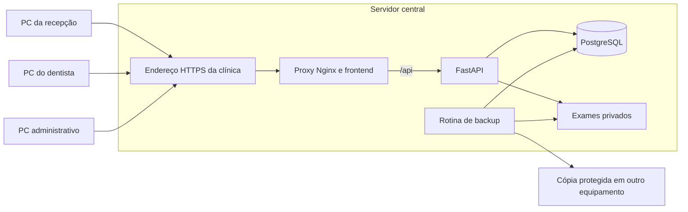

# Revisão técnica — ERP Dents

Data: 15/09/2026. Código de referência: `7401b1a`.

## 1. Parecer executivo

O projeto tem uma base adequada para uma clínica odontológica: aplicação web, API central, PostgreSQL e arquivos de exames no servidor. Recomendo manter essa arquitetura e evoluir o produto como um monólito modular. Cada computador deve acessar um endereço pelo navegador; um atalho é suficiente para o uso diário.

**O estado atual é de MVP, com bloqueadores para produção com dados reais e usuários simultâneos.** Os principais são: isolamento incorreto entre desenvolvimento e produção, sessão/cache, uploads, permissões administrativas, concorrência de agenda e financeiro, preservação do histórico e recuperação de dados. A instalação ainda exige decisões técnicas demais do usuário.

Não é necessário reescrever o sistema nem criar um aplicativo desktop para cada estação. O maior retorno vem de corrigir integridade e segurança, consolidar os fluxos clínicos e entregar instalação, atualização e backup assistidos.

### O que já existe

| Área | Implementação encontrada | Maturidade para o objetivo |
|---|---|---|
| Acesso | Login, JWT, usuários ativos/inativos, troca e redefinição de senha, primeiro administrador | Funcional, com lacunas de segurança e recuperação |
| Permissões | Matriz por perfil, controle em rotas e menus | Boa base; faltam limites administrativos e coerência entre recursos |
| Cadastros | Pacientes, dentistas, especialidades, procedimentos | CRUDs funcionais; validação, paginação e vínculos precisam evoluir |
| Agenda | Lista, calendário dia/semana/mês, procedimentos, duração sugerida, disponibilidade e conflitos | Regras básicas presentes; concorrência e atualização entre PCs insuficientes |
| Consulta | Próxima consulta e consulta de dados do paciente | Ainda não é um prontuário de atendimento |
| Exames | Upload, listagem, download, abertura, exclusão | Falta controle de conteúdo, tamanho, ciclo de vida e integridade |
| Financeiro | Receitas/despesas, desconto/acréscimo, baixa, resumo e geração pela consulta | Livro simples de lançamentos; falta histórico e modelo de pagamentos |
| Operação | Docker Compose, migrações, volumes, README, Jenkins de exemplo | Adequado para desenvolvimento; falta pacote operacional para a clínica |

### Pontos positivos que devem ser preservados

- Dados centralizados, sem acesso direto dos clientes ao banco em produção.
- PostgreSQL e volumes persistentes, com migrações versionadas.
- Uso de UUIDs, consultas pelo ORM, senhas com hash e algoritmo JWT explicitamente limitado a HS256.
- A API consulta novamente o usuário: desativação e mudança de perfil têm efeito nas próximas requisições.
- Validação de conflito para dentista **e paciente**, com intervalos adjacentes permitidos.
- Valores monetários em centavos inteiros no domínio e no banco.
- Separação inicial entre domínio, casos de uso, persistência e HTTP; há desvios corrigíveis.

## 2. Escopo, evidências e limites

Inspecionei a estrutura versionada, os módulos da API, componentes e fluxos do frontend, modelos, sete migrações, containers, configuração e documentação. Foram inventariados 130 arquivos versionados, dos quais 71 são Python; a análise sintática cobriu os 71. A revisão combinou leitura e cruzamento de chamadas, compilação, inspeção de metadados e reproduções pontuais.

| Verificação | Resultado |
|---|---|
| `npm run build` | Passou; JavaScript principal de 697,35 kB, 204,35 kB gzip; aviso de bundle grande |
| TypeScript com `--noUnusedLocals --noUnusedParameters` | Passou; isso não detecta automaticamente exports públicos sem consumidores |
| Sintaxe Python por AST | 71 arquivos válidos |
| Importação da API e geração OpenAPI | Passou; 33 caminhos OpenAPI |
| FastAPI TestClient, `/health` sem banco disponível | HTTP 200, comprovando que o endpoint não verifica o banco |
| Compose produção e desenvolvimento, `config` | Sintaxe válida; aviso de campo `version` obsoleto |
| Comparação dos volumes resolvidos | Desenvolvimento e produção apontam para os mesmos volumes com os comandos documentados |
| Data de nascimento no fuso de São Paulo | `2000-01-15` foi formatada como `14/01/2000` |
| Cache de consulta com troca de usuário | Mesma chave retornou o paciente anterior sem nova requisição durante `staleTime` |
| Casos de uso com repositórios simulados | Confirmados: erros com `null`, paciente inativo aceito em agendamento, horário `25:00` aceito no schema e baixa repetida alterando data |
| bcrypt configurado | Senhas que diferem após o byte 72 foram verificadas como equivalentes |
| Script documentado de recuperação | Falhou antes de acessar o banco: `ModuleNotFoundError: No module named 'src'` |
| `npm audit` | 2 pacotes sinalizados com severidade moderada, ligados a React Router |
| `pip-audit -r requirements.txt` | 33 ocorrências reportadas, correspondendo a 17 IDs distintos em 4 pacotes; há duplicatas no resultado do scanner |

Os resultados de dependências estão em [revisao-dependencias-2026-09-15.json](./revisao-dependencias-2026-09-15.json). Eles descrevem as versões resolvidas nesta revisão, porque o repositório original não fixa toda a árvore de dependências. Alertas de pacotes não equivalem a vulnerabilidades exploráveis comprovadas no ERP.

**Limite da validação:** o Docker CLI está instalado, mas o daemon Linux não estava disponível. Não executei PostgreSQL, migrações online, restauração, teste de carga nem navegação completa integrada em vários computadores. As condições de corrida foram identificadas pela sequência de consultas/gravações e ausência de garantias no banco; precisam de testes concorrentes contra PostgreSQL. As reproduções de casos de uso usaram dependências simuladas, não persistência real. Não houve correção do código funcional nesta entrega.

### Prioridades

- **P1 — antes de produção:** risco relevante para acesso, dados, operação diária ou recuperação.
- **P2 — próxima etapa:** inconsistência funcional, usabilidade, desempenho ou manutenção que deve entrar no plano imediato.
- **P3 — aperfeiçoamento:** limpeza e evolução com menor urgência.

“Confirmado” indica evidência direta no código/configuração ou reprodução indicada. “Risco identificado” indica uma consequência plausível ainda sem teste integrado. “Lacuna de produto” indica capacidade que ainda precisa ser construída.

## 3. Instalação, rede e operação

### R01 — P1 — Desenvolvimento e produção compartilham os mesmos dados

**Confirmado pela configuração resolvida.** [docker-compose.yml](../docker-compose.yml#L55) e [docker-compose.dev.yml](../docker-compose.dev.yml#L62) usam `postgres_data` e `exams_data`, sob o mesmo nome de projeto Compose quando executados na mesma pasta.

Nesta revisão, ambos resolveram para `projeto-erp-dents_postgres_data` e `projeto-erp-dents_exams_data`. O sufixo `_dev` dos nomes de containers não isola os volumes. Subir desenvolvimento no mesmo host pode reutilizar dados reais e executar migrações sobre eles. Tentar manter duas instâncias PostgreSQL no mesmo diretório de dados também é uma configuração inválida e perigosa.

**Correção:** nomes explícitos e diferentes de projeto/volumes, por exemplo produção e desenvolvimento; configuração de testes independente; confirmação automatizada de que o ambiente de desenvolvimento nunca usa o volume de produção. O instalador deve identificar uma instalação existente e preservar sua identidade. [Isolamento por projeto no Docker Compose](https://docs.docker.com/compose/how-tos/project-name/).

### R02 — P1 — A configuração padrão não entrega acesso simples pela rede

**Confirmado.** [api.ts](../apps/web/src/lib/api.ts#L6), [Dockerfile web](../apps/web/Dockerfile#L5), [.env.example](../.env.example#L12) e [nginx.conf](../apps/web/nginx.conf#L1).

O frontend é compilado com `PUBLIC_API_URL`, cujo padrão é `http://localhost:8000`. No computador cliente, `localhost` é o próprio cliente. Além disso, as origens CORS do exemplo são da porta 9001 e não incluem a porta 8080 de produção. Copiar o exemplo e iniciar produção não fornece uma instalação pronta para uso. A documentação exige ajustes manuais, mas não há validação que os garanta.

**Correção:** frontend e API sob uma única origem: navegador → servidor → Nginx → `/api` → FastAPI. Usar URLs relativas no frontend, publicar somente o ponto de entrada e encaminhar `/api` pelo proxy. Assim, mudar IP/nome não exige recompilar o frontend nem editar CORS nas estações. Variáveis `import.meta.env` são substituídas no build. [Documentação do Vite](https://vite.dev/guide/env-and-mode).

### R03 — P1 — HTTPS e configuração segura ainda não fazem parte da instalação

**Confirmado.** O Compose e o Nginx publicam HTTP; a API também é exposta diretamente. [docker-compose.yml](../docker-compose.yml#L36), [nginx.conf](../apps/web/nginx.conf#L1), [config.py](../apps/api/src/config.py#L27).

Senhas, tokens e dados de pacientes trafegam sem proteção de transporte nesse desenho. O backend aceita segredos conhecidos (`CHANGE_ME` e o exemplo), sem rejeitar uma instalação insegura. Com o segredo conhecido e um ID de usuário válido, a assinatura JWT deixa de proteger a identidade.

**Correção:** gerar segredos aleatórios por instalação, rejeitar padrões/vazios no startup e automatizar HTTPS com certificado confiável pelas estações. Publicar somente o proxy na rede da clínica, manter banco/API internos e limitar firewall à rede necessária. Configurar headers adequados, inclusive proteção contra interpretação indevida de arquivos e política de conteúdo. Se houver acesso externo no futuro, tratá-lo como uma implantação própria, com VPN ou solução equivalente avaliada.

### R04 — P1 — Backup manual não garante recuperação consistente

**Lacuna operacional.** [README.md](../README.md) descreve `pg_dump` e cópia de exames em momentos separados. Não há agendamento, retenção, monitoramento, criptografia, cópia fora do servidor ou ensaio de restauração.

Uma exclusão entre o dump e a cópia pode produzir banco que referencia arquivo ausente. Copiar somente o volume do banco enquanto ele está em execução não substitui um backup PostgreSQL consistente.

**Correção:** rotina automática que produza um conjunto identificado por data/versão, com banco, exames, manifesto e configuração necessária à recuperação. Para esta escala, uma breve janela sem gravações pode simplificar a consistência. Adotar arquivos imutáveis/exclusão diferida também ajuda. Guardar cópia em outro equipamento, definir retenção, alertar falhas e testar restauração em ambiente isolado. [Backup de volumes Docker](https://docs.docker.com/engine/storage/volumes/).

Definir com a clínica quanto de trabalho pode ser perdido e em quanto tempo o serviço deve voltar. Uma proposta inicial para discussão é perder no máximo uma hora e restaurar em até duas horas; são metas, não capacidades demonstradas pelo sistema atual.

### R05 — P1 — Atualização depende de compilar e migrar diretamente no servidor

**Confirmado.** [README.md](../README.md), [Dockerfile API](../apps/api/Dockerfile#L17), [Dockerfile web](../apps/web/Dockerfile#L9), [Jenkinsfile](../Jenkinsfile#L1).

`git pull` seguido de `up --build` exige internet, ferramentas e resolução de dependências no servidor. A API executa migrações em todo startup, sem fluxo de manutenção/backup e sem validação operacional posterior. Não há versão de release, checksum, pacote offline ou reversão ensaiada. Voltar uma imagem não desfaz uma migração incompatível.

**Correção:** gerar imagens versionadas no pipeline, instalar versões publicadas e homologadas, fazer backup antes de migrar, registrar a versão instalada e verificar prontidão após a atualização. Executar migração uma vez por atualização, de forma coordenada. Planejar compatibilidade entre versões e recuperação com backup quando a reversão de schema não for segura.

### R06 — P1 — Diagnóstico e inicialização automática estão incompletos

**Confirmado.** [main.py](../apps/api/src/main.py#L47) sempre responde saudável; apenas o banco tem healthcheck no Compose. A API e o web têm reinício automático em produção, o que é positivo, mas não há prova de retomada após reinício do host sem login humano.

**Correção:** separar “processo está vivo” de “sistema está pronto”; verificar banco, versão de migração, acesso ao diretório de exames e disponibilidade de espaço. Incluir status legível, versão, último backup, logs com identificador de requisição e rotação. Tratar disco cheio, falha de permissão e banco indisponível com mensagens úteis. Alertas devem evitar dados clínicos e segredos.

### R07 — P1 — Recuperação de senha documentada falha

**Reproduzido.** [reset_admin_password.py](../apps/api/scripts/reset_admin_password.py#L8) importa `src`, mas a execução por caminho coloca `scripts` no início do caminho de módulos. No ambiente isolado, o comando documentado falhou com `ModuleNotFoundError`.

**Correção:** transformar em comando de manutenção instalado ou documentar/testar execução como módulo, a partir do diretório correto. Receber a senha com prompt oculto, evitando argumento visível em histórico/lista de processos; também registrar auditoria de recuperação e invalidar sessões. O nome sugere administrador, mas o script localiza qualquer usuário por e-mail: esclarecer o escopo.

## 4. Segurança, usuários e permissões

### R08 — P1 — Permissão para gerir usuários permite obter poder de administrador

**Atualização:** corrigido na [etapa 1C.1](./homologacao-etapa-1C1.md), com proteção pelo ator/alvo no backend, interface coerente e testes HTTP/PostgreSQL. A descrição abaixo registra o estado original.

**Confirmado no controle implementado; depende de delegar `users.create` ou `users.update`.** [users_router.py](../apps/api/src/api/routers/users_router.py#L46), [user_use_cases.py](../apps/api/src/core/use_cases/user_use_cases.py#L25).

Os endpoints verificam a ação genérica, mas aceitam `role=admin`. Quem recebe criação pode criar administrador; quem recebe atualização pode promover a si mesmo ou redefinir a senha de um administrador. Os perfis padrão negam essas ações, mas a tela permite que o administrador as delegue sem apresentar esse efeito.

**Correção:** separar gestão operacional de contas de gestão de administradores; somente administrador pode criar/promover/alterar senha de administrador. Passar o ator ao caso de uso e verificar alvo, perfil anterior e perfil solicitado. Testar a API diretamente, pois esconder opções na tela é insuficiente.

### R09 — P1 — É possível perder o último administrador e reabrir bootstrap

**Atualização:** perda do último administrador ativo pelas rotas de gestão corrigida na [etapa 1C.1](./homologacao-etapa-1C1.md), inclusive sob concorrência. Reabertura e disputa de bootstrap corrigidas na [etapa 1C.2](./homologacao-etapa-1C2.md). A descrição abaixo registra o estado original.

**Confirmado.** [user_use_cases.py](../apps/api/src/core/use_cases/user_use_cases.py#L46), [auth_use_cases.py](../apps/api/src/core/use_cases/auth_use_cases.py#L16).

Não há proteção contra excluir, desativar ou rebaixar o último administrador. Se outros usuários permanecerem, o sistema fica sem administração e o bootstrap continua bloqueado. Se todos forem excluídos, o bootstrap público volta a ficar disponível.

**Correção:** manter pelo menos um administrador ativo, bloquear ações perigosas sobre a própria conta quando aplicável e preservar o estado permanente de instalação concluída. Executar a verificação e a mudança em uma transação protegida contra concorrência.

### R10 — P1 — Bootstrap público tem corrida e não comprova posse do servidor

**Atualização:** corrigido na [etapa 1C.2](./homologacao-etapa-1C2.md): código local de ativação, estado persistente e criação transacional exclusiva, com testes de migração, rollback, concorrência e HTTP. A descrição abaixo registra o estado original.

**Risco identificado.** [auth_router.py](../apps/api/src/api/routers/auth_router.py#L31), [auth_use_cases.py](../apps/api/src/core/use_cases/auth_use_cases.py#L19).

O primeiro cliente que alcança a API com banco vazio pode criar o administrador. Duas requisições simultâneas com e-mails diferentes podem ambas verificar contagem zero antes de gravar.

**Correção:** segredo de ativação de uso único gerado pelo instalador ou provisionamento local do primeiro administrador, com estado de bootstrap e transação exclusiva. Exibir na interface uma configuração inicial simples, sem pedir ao usuário que entenda endpoints.

### R11 — P1 — Logout e troca de senha não encerram a validade do token

**Atualização após a revisão:** parte de navegador corrigida na [etapa 1B](./homologacao-etapa-1B.md). Revogação no servidor implementada na [etapa 1C.3](./homologacao-etapa-1C3.md): logout individual, invalidação por senha/status/identidade, persistência entre reinícios e testes reais. Armazenamento em `localStorage` permanece para revisão própria. A descrição abaixo registra o estado original revisado.

**Confirmado.** [use-auth.tsx](../apps/web/src/hooks/use-auth.tsx#L37), [jwt_auth_service.py](../apps/api/src/adapters/security/jwt_auth_service.py#L27), [auth_use_cases.py](../apps/api/src/core/use_cases/auth_use_cases.py#L55).

Logout só remove o token local. Alterar ou redefinir senha modifica o hash, mas tokens emitidos antes continuam válidos até expirar; o padrão é oito horas. Também não há tratamento global de 401 para conduzir o usuário novamente ao login, nem sincronização de sessão entre abas. Falha transitória de rede durante `refreshMe` é tratada como logout.

**Correção:** modelar sessões revogáveis ou versão de sessão por usuário, revogar após recuperação de senha, tratar expiração e falha de rede separadamente e sincronizar abas. Avaliar cookie `HttpOnly`, `Secure` e `SameSite`, incluindo proteção contra CSRF se mudar para autenticação por cookie. O token atual está em `localStorage`, acessível a JavaScript da mesma origem. [Orientação OWASP sobre armazenamento no navegador](https://cheatsheetseries.owasp.org/cheatsheets/HTML5_Security_Cheat_Sheet.html).

### R12 — P2 — Faltam limites de tentativas e política consistente de senha

**Confirmado.** [auth_router.py](../apps/api/src/api/routers/auth_router.py#L40), [schemas.py](../apps/api/src/api/schemas/schemas.py), [jwt_auth_service.py](../apps/api/src/adapters/security/jwt_auth_service.py#L17).

Não há limitação de tentativas de login. O login também diferencia usuário inativo antes de verificar a senha. A configuração de bcrypt aceita senhas longas, mas só considera os primeiros 72 bytes: a equivalência foi reproduzida. Nomes só de espaços também passam pela criação de usuário/bootstrap em alguns caminhos.

**Correção:** limitação progressiva por conta e origem, mensagens de autenticação consistentes, normalização e limites de entrada. Usar hash com política de tamanho adequada e migração de hashes existentes, ou rejeitar explicitamente excesso de bytes enquanto mantiver bcrypt. Melhorias de senha não devem invalidar silenciosamente credenciais atuais.

### R13 — P1 — Dados clínicos e administrativos não têm escopos separados

**Confirmado; a política final depende da clínica.** [permissions.py](../apps/api/src/core/permissions.py), [patients_router.py](../apps/api/src/api/routers/patients_router.py#L25), [appointments_router.py](../apps/api/src/api/routers/appointments_router.py#L79), [consultations_router.py](../apps/api/src/api/routers/consultations_router.py#L59).

Recepção pode consultar e atualizar o mesmo objeto que contém alergias e histórico médico. Dentista, por padrão, pode atualizar qualquer agendamento pelo ID e consultar o financeiro global. O módulo Consulta restringe os próximos horários ao dentista, mas sua lista de pacientes continua global. Revogar `patients.view` não impede acesso a dados de pacientes via `consultations.view`.

**Correção:** definir uma matriz baseada em tarefas: cadastro administrativo, leitura clínica, edição clínica, agenda própria/global, financeiro e administração. Proteger objetos e campos no backend, com respostas específicas para cada finalidade. Acesso compartilhado entre dentistas pode ser legítimo; deve ser uma decisão explícita e auditável, não um efeito colateral da implementação.

### R14 — P2 — A matriz oferece permissões que não correspondem ao comportamento

**Confirmado.** [App.tsx](../apps/web/src/App.tsx), [permissions-page.tsx](../apps/web/src/pages/permissions/permissions-page.tsx), [dashboard-page.tsx](../apps/web/src/pages/dashboard-page.tsx#L8).

- `calendar.view` libera a página, mas buscar eventos exige `appointments.view`; cadastros auxiliares também são consultados sem verificar suas permissões.
- `dashboard.view` pode liberar um painel que falha inteiro quando uma das permissões de dados está negada.
- Consulta é oferecida na matriz e permitida na API a outros perfis, mas a rota e o menu web aceitam somente dentistas.
- Permissões de criar/editar/excluir painel, calendário e consulta não têm ações independentes correspondentes; editar exames tampouco tem endpoint.
- A página de exames busca dados do paciente mesmo quando apenas `exams.view` foi concedida.
- A normalização preenche permissões ausentes com padrões que podem conceder acesso a recursos recém-adicionados; leituras ainda podem gravar essa normalização no banco.

**Correção:** uma matriz de capacidades efetivamente implementadas, dependências explícitas ou endpoints auxiliares mínimos, estratégia segura para novos recursos e testes por perfil. Remover opções sem efeito. Não reescrever permissões em requisições de leitura: migração ou inicialização explícita é mais previsível.

## 5. Uso simultâneo e integridade

### R15 — P1 — Cache permanece depois de sair e pode atravessar usuários

**Atualização após a revisão:** corrigido na [etapa 1B](./homologacao-etapa-1B.md), com cache por sessão, descarte de respostas antigas e validação automatizada/integrada. A descrição abaixo registra o estado original reproduzido.

**Reproduzido no mecanismo de cache e confirmado nos fluxos.** [use-auth.tsx](../apps/web/src/hooks/use-auth.tsx#L37), [query-client.ts](../apps/web/src/lib/query-client.ts#L3), [consultation-page.tsx](../apps/web/src/pages/consultations/consultation-page.tsx#L18).

O QueryClient é global e não é limpo no logout. As chaves de dados não incluem a sessão. Em Consulta, `dentistId` fica `undefined` para usuários dentistas porque a API resolve o vínculo; assim, dois dentistas usam exatamente a mesma chave. Na reprodução, a segunda consulta recebeu dados anteriores e fez zero novas requisições dentro dos 15 segundos de `staleTime`.

**Correção:** cancelar requisições em andamento e limpar caches de consultas/mutações na troca de sessão, identificar consultas por usuário/escopo e impedir que uma resposta antiga repovoe o cache da nova sessão. Testar sair de um usuário e entrar em outro no mesmo navegador sem recarregar a página.

### R16 — P1 — Conflito de agenda não é garantido sob concorrência

**Risco identificado no desenho transacional.** [appointment_use_cases.py](../apps/api/src/core/use_cases/appointment_use_cases.py#L56), [appointment_repository.py](../apps/api/src/adapters/db/repositories/appointment_repository.py#L63), [models.py](../apps/api/src/adapters/db/models/models.py#L171).

O fluxo consulta conflitos e depois insere. Duas recepcionistas podem consultar simultaneamente, ambas obterem “livre” e ambas gravarem. Os modelos e migrações não têm restrições de exclusão por intervalo nem outra serialização equivalente.

**Correção:** garantir exclusão de intervalos sobrepostos no PostgreSQL para dentista e paciente, desconsiderando cancelados e usando intervalo `[início, fim)`, mais restrição `fim > início`. Traduzir a violação para 409 com mensagem amigável. O PostgreSQL 16 suporta restrições de exclusão com intervalos. [Documentação oficial](https://www.postgresql.org/docs/16/rangetypes.html).

### R17 — P1 — Uma consulta pode gerar cobranças duplicadas simultâneas

**Risco identificado no desenho transacional.** [financial_use_cases.py](../apps/api/src/core/use_cases/financial_use_cases.py#L148), [financial_repository.py](../apps/api/src/adapters/db/repositories/financial_repository.py#L89), [models.py](../apps/api/src/adapters/db/models/models.py).

A regra de um lançamento ativo por consulta usa consulta prévia, seguida de criação. `appointment_id` tem índice comum, sem unicidade parcial. Duplo clique/reenvio após timeout ou dois PCs podem passar pela verificação ao mesmo tempo.

**Correção:** inicialmente, índice único parcial para consulta vinculada com status diferente de cancelado, se essa continuar sendo a regra de negócio, e chave de idempotência nas operações de geração. Se houver parcelamento, substituir essa regra por uma cobrança com parcelas/pagamentos filhos, preservando idempotência na criação da cobrança.

### R18 — P1 — Duas pessoas podem sobrescrever alterações uma da outra

**Confirmado: não existe controle de versão nas atualizações.** [patient_repository.py](../apps/api/src/adapters/db/repositories/patient_repository.py#L48), [appointment_use_cases.py](../apps/api/src/core/use_cases/appointment_use_cases.py#L75), [financial_use_cases.py](../apps/api/src/core/use_cases/financial_use_cases.py#L91).

Formulários enviam o registro inteiro; casos de uso também mesclam e regravam campos. Se A e B abrem o mesmo registro, B pode salvar dados antigos sobre a alteração de A. `updated_at` existe, mas não é usado como pré-condição.

**Correção:** versão incremental ou ETag/`If-Match`, atualização condicionada à versão lida e resposta 409/412. A interface deve informar que o registro mudou e permitir revisar as diferenças. Campos clínicos e financeiros merecem atenção especial.

### R19 — P1 — Uma estação não acompanha automaticamente as mudanças das outras

**Confirmado.** [query-client.ts](../apps/web/src/lib/query-client.ts#L7), [calendar-page.tsx](../apps/web/src/pages/appointments/calendar-page.tsx#L258), [consultation-page.tsx](../apps/web/src/pages/consultations/consultation-page.tsx#L22).

`refetchOnWindowFocus` está desativado e não há polling, SSE ou WebSocket. Invalidar cache depois de salvar atualiza somente aquele navegador. `staleTime` marca dados como antigos, mas não funciona como temporizador de atualização. [TanStack Query](https://tanstack.com/query/latest/docs/framework/react/guides/important-defaults).

**Correção:** começar com atualização periódica nas telas operacionais, atualização ao recuperar foco/rede e indicação de “atualizado às...”. Um intervalo inicial de 15–30 segundos é uma proposta a medir; SSE pode vir depois se a clínica precisar de atualização imediata. Também invalidar Consulta quando agendamentos mudarem no mesmo navegador e recalcular os indicadores ao virar o dia.

## 6. Agenda, cadastros e prontuário

### R20 — P2 — Datas sem horário são tratadas como instantes UTC

**Reproduzido.** [datetime.ts](../apps/web/src/lib/datetime.ts#L6): `new Date('2000-01-15').toLocaleDateString('pt-BR')` resulta em `14/01/2000` no fuso de São Paulo. Isso afeta nascimento na lista de pacientes e em Consulta. A tabela financeira já usa uma conversão diferente, evidenciando a inconsistência.

Além disso, o vencimento padrão usa `new Date().toISOString().slice(0, 10)` em [financial-page.tsx](../apps/web/src/pages/financial/financial-page.tsx#L329), podendo mudar para o dia seguinte após 21h em São Paulo. A geração pela consulta usa a data/hora recebida do banco sem conversão explícita ao fuso clínico. Horários no frontend dependem do fuso de cada computador, enquanto a validação da agenda fixa São Paulo.

**Correção:** separar utilitários de data civil e de instante; datas civis devem preservar ano/mês/dia. Instantes devem ter offset obrigatório e exibição no fuso configurado da clínica. Testar nascimento, virada do dia, horários noturnos e PCs com fusos diferentes.

### R21 — P2 — Schemas aceitam `null` que os casos de uso não suportam

**Reproduzido.** [schemas.py](../apps/api/src/api/schemas/schemas.py), [user_use_cases.py](../apps/api/src/core/use_cases/user_use_cases.py#L46), [appointment_use_cases.py](../apps/api/src/core/use_cases/appointment_use_cases.py#L75).

`UserUpdateRequest(email=None)` é válido no schema, mas provoca `AttributeError` no `.lower()`. `AppointmentUpdateRequest(start_at=None)` chega à comparação de datas e causa `TypeError`. Flags obrigatórias também aceitam `null` no schema e podem violar `NOT NULL`. Datas sem timezone ou com mistura de datas com/sem offset não são normalizadas de forma consistente.

**Correção:** diferenciar campo omitido de campo explicitamente nulo e rejeitar `null` para campos obrigatórios antes do caso de uso. Usar contratos de criação/edição precisos, limites de texto/valores e datas com timezone para agendamentos. Retornar erros de validação, não 500.

### R22 — P2 — Regras de disponibilidade e inativação são inconsistentes

**Reproduzido em parte e confirmado no código.** [appointment_use_cases.py](../apps/api/src/core/use_cases/appointment_use_cases.py#L121), [dentist_use_cases.py](../apps/api/src/core/use_cases/dentist_use_cases.py#L76), [schemas.py](../apps/api/src/api/schemas/schemas.py#L100).

- Paciente inativo pode ser agendado; procedimento inativo também é aceito. Dentista inativo é bloqueado.
- O schema aceita `25:00`–`26:00`: a regex valida formato, não o relógio. A disponibilidade é depois ignorada pela agenda.
- Atualizar apenas notas/status de uma consulta histórica revalida a disponibilidade atual do dentista. Mudar o horário de trabalho ou inativar um dentista pode impedir correções de consultas antigas.
- Não há bloqueios por férias, feriados ou ausência, nem recursos como cadeira/sala.
- Concluído, confirmado, cancelado e agendado podem transitar livremente; não há máquina de estados de atendimento.

**Correção:** validar horários reais, definir política para cadastros inativos e preservar vínculos históricos. Revalidar disponibilidade ao mudar o agendamento quando necessário, não indiscriminadamente. Introduzir estados e regras explícitas; bloqueios de agenda por data são mais urgentes do que recorrência sofisticada.

### R23 — P2 — Cadastros não garantem identificação e vínculos consistentes

**Confirmado.** [patient_use_cases.py](../apps/api/src/core/use_cases/patient_use_cases.py#L30), [patient_repository.py](../apps/api/src/adapters/db/repositories/patient_repository.py#L15), [models.py](../apps/api/src/adapters/db/models/models.py), [dentists-page.tsx](../apps/web/src/pages/dentists/dentists-page.tsx).

CPF é texto livre no backend, sem dígitos verificadores/normalização; uma busca só por dígitos pode não localizar um CPF salvo com pontuação. O mesmo ocorre com telefone. Nome social/preferido é cadastrado mas não participa da busca. A máscara de telefone é repetida e organiza até números fixos como celular. Especialidade do dentista é texto, sem FK: renomear/excluir a especialidade não atualiza o vínculo. CRO e vínculo de usuário ao dentista não têm validações de domínio suficientes.

**Correção:** normalizar documentos/telefones no backend e formatar só na interface; validar CPF quando informado; sinalizar possível duplicidade sem exigir CPF para todos os pacientes. Representar especialidade por ID, suportar a cardinalidade necessária e definir integridade do vínculo usuário–dentista. Acrescentar responsável legal/financeiro para menores, distinto de contato de emergência.

### R24 — P2 — Listas escondem registros além do limite inicial

**Confirmado.** Pacientes, usuários, procedimentos, especialidades, dentistas e Consulta usam `limit: 100, offset: 0`; financeiro usa 200. Exemplos: [patients-page.tsx](../apps/web/src/pages/patients/patients-page.tsx#L110), [financial-page.tsx](../apps/web/src/pages/financial/financial-page.tsx#L191).

Não há navegação para as páginas seguintes. O usuário pode interpretar registros antigos como ausentes, embora buscas mais específicas ainda possam localizá-los.

**Correção:** paginação de ponta a ponta com total e posição, ordenação estável e busca com pequeno atraso entre digitações. Seletores devem buscar registros sob demanda e preservar o item escolhido; carregar tudo com `listAll` em outras telas não resolve a escalabilidade.

### R25 — P1 — Consulta ainda não registra um atendimento clínico

**Lacuna de produto.** [consultation_use_cases.py](../apps/api/src/core/use_cases/consultation_use_cases.py#L12), [consultation-page.tsx](../apps/web/src/pages/consultations/consultation-page.tsx#L15), [entities.py](../apps/api/src/core/domain/entities.py).

Não existe entidade de evolução/atendimento com autor, data, conteúdo, finalização e correção posterior. O histórico médico é um texto editável no paciente. A tela Consulta exibe dados e próximos horários, sem registrar evolução ou apresentar uma linha do tempo clínica completa. A busca de “próxima” usa início maior ou igual a agora: um atendimento que começou há poucos minutos desaparece da seleção; exclui cancelados, mas não concluídos.

**Correção:** separar agendamento de atendimento. Criar prontuário por paciente com anamnese estruturada, alergias em destaque, evolução por atendimento, autor, finalização e adendos rastreáveis; relacionar exames, procedimentos e plano de tratamento. Criar fila do dia e estado “em atendimento”. Odontograma, prescrição, assinatura e documentos podem entrar conforme escopo validado com a clínica.

## 7. Financeiro e preservação de histórico

### R26 — P1 — Pagamentos e registros históricos podem ser reescritos ou apagados

**Confirmado; baixa repetida reproduzida.** [financial_use_cases.py](../apps/api/src/core/use_cases/financial_use_cases.py#L91), [financial_repository.py](../apps/api/src/adapters/db/repositories/financial_repository.py#L153), [appointment_repository.py](../apps/api/src/adapters/db/repositories/appointment_repository.py#L131).

Uma baixa repetida atualiza `paid_at` para agora, mesmo quando o lançamento já estava pago. Editar permite mudar valor, status e vínculos de um lançamento pago; excluir remove o registro. Agendamentos também podem ser apagados. A exclusão de vínculos financeiros usa `SET NULL`, perdendo a relação histórica. Não há registro de quem fez a alteração ou qual era o valor anterior.

**Correção:** baixa idempotente, pagamentos como registros próprios e imutáveis, estorno/cancelamento com motivo e autoria. Restringir alterações de lançamentos já pagos. Preferir inativação/cancelamento para registros com histórico e criar trilha de auditoria. Preservar identificações e descrições históricas necessárias mesmo se um cadastro mudar.

### R27 — P2 — O financeiro pode mostrar totais que não correspondem à leitura do usuário

**Confirmado.** [financial-page.tsx](../apps/web/src/pages/financial/financial-page.tsx#L196), [financial_repository.py](../apps/api/src/adapters/db/repositories/financial_repository.py#L163).

Os filtros de paciente/dentista/tipo/status/busca afetam a lista, mas o resumo considera somente as datas. “Recebido” e “saldo realizado” são filtrados pelo vencimento, não pela data do pagamento. Exemplo: um título vencido em janeiro e pago em fevereiro aparece no realizado de janeiro ao filtrar por vencimento. Erro/carregamento no resumo é apresentado como zero pelos `?? 0`, sem estado explícito.

**Correção:** distinguir visão por vencimento/competência e fluxo de caixa por pagamento. Sincronizar filtros quando o resumo pretende refletir a lista, ou identificá-lo claramente como resumo global. Exibir carregamento/falha em vez de valor financeiro zero. Agregar no SQL, evitando carregar todos os lançamentos para somar em Python.

### R28 — P2 — Cobrança por consulta não preserva composição histórica nem cobre pagamentos reais

**Confirmado e lacuna de produto.** [financial_use_cases.py](../apps/api/src/core/use_cases/financial_use_cases.py#L148), [models.py](../apps/api/src/adapters/db/models/models.py).

Gerar uma cobrança usa o preço atual dos procedimentos, sem itens com preço/quantidade históricos. Procedimentos são IDs em JSON no financeiro, sem FK; a consulta pode mudar depois da geração e divergir da cobrança. A API permite gerar cobrança de consulta cancelada, embora a UI filtre canceladas. Há um status e uma forma de pagamento por lançamento, sem pagamentos parciais, múltiplos meios, parcelas, devoluções ou conciliação.

**Correção:** cobrança com itens e valores congelados, origem e revisão explícita; regras para consultas canceladas/alteradas; pagamentos filhos, saldo aberto e estornos. Depois, considerar fechamento de caixa, comprovantes, orçamento/plano de tratamento, mensalidades e repasse ao dentista, conforme a operação. Integração fiscal/convênios deve ter escopo próprio, sem presumir que o CRUD financeiro atual já a atende.

### R29 — P1 — Exclusões e falhas deixam banco e exames inconsistentes

**Confirmado no fluxo.** [exam_use_cases.py](../apps/api/src/core/use_cases/exam_use_cases.py#L25), [patient_repository.py](../apps/api/src/adapters/db/repositories/patient_repository.py#L80), [models.py](../apps/api/src/adapters/db/models/models.py).

Upload grava o arquivo antes do registro no banco: falha de commit deixa órfão. Exclusão remove o arquivo antes de confirmar o banco: falha de commit deixa registro sem arquivo. Excluir paciente sem agendamentos elimina metadados de exames por cascata, mas não os arquivos físicos. Se houver agendamentos, FKs restritivas podem bloquear a exclusão e gerar erro 500 não tratado.

**Correção:** armazenamento temporário seguido de confirmação, compensação em falhas, exclusão lógica e limpeza posterior controlada. Reconciliar periodicamente metadados e arquivos. Para pacientes com histórico, adotar política de retenção e inativação, preservando acesso autorizado e rastreabilidade.

## 8. Exames e proteção dos dados

### R30 — P1 — Arquivos ativos podem ser abertos na origem do ERP

**Risco de execução de script identificado; não houve prova integrada no navegador.** [exams_router.py](../apps/api/src/api/routers/exams_router.py#L41), [exam_use_cases.py](../apps/api/src/core/use_cases/exam_use_cases.py#L25), [services.ts](../apps/web/src/lib/services.ts#L396).

O backend confia no nome e MIME informado pelo upload; não restringe conteúdo. O frontend baixa como Blob e abre qualquer arquivo. Um HTML com script, por exemplo, pode ser renderizado como documento ativo. URLs Blob carregam a origem de quem as criou; junto com JWT em `localStorage`, isso forma um caminho de risco para sessão/dados. `noopener` não torna o conteúdo um documento isolado da origem. [Comportamento de Blob URLs](https://developer.mozilla.org/en-US/docs/Web/URI/Reference/Schemes/blob).

**Correção:** permitir somente tipos necessários, verificar assinatura real do arquivo e limitar a prévia a formatos seguros. Bloquear HTML/SVG ativo conforme política; disponibilizar arquivos não visualizáveis por download controlado ou em origem isolada/sandbox. Definir CSP e `nosniff`. Arquivos devem permanecer fora da raiz pública. [Orientações de upload OWASP](https://cheatsheetseries.owasp.org/cheatsheets/File_Upload_Cheat_Sheet.html).

### R31 — P1 — Upload sem limite pode consumir memória, disco e bloquear a API

**Confirmado.** [exams_router.py](../apps/api/src/api/routers/exams_router.py#L48) lê todo o conteúdo com `await file.read()` e depois executa operações síncronas de banco/disco dentro da função `async`. O processo padrão da API é único. O frontend aplica timeout genérico de 15 segundos, sem progresso nem estratégia para arquivo grande.

**Correção:** limite configurável por arquivo/requisição e quota, leitura por blocos, validação antecipada de tamanho e execução do trabalho bloqueante fora do event loop. Validar espaço livre, devolver 413 quando necessário e implementar progresso/cancelamento. Alinhar limites no proxy e na API. Limites devem ser definidos a partir dos exames realmente utilizados; radiografias e arquivos 3D podem ter necessidades diferentes.

### R32 — P1 — Governança de dados e auditoria precisam ser desenhadas

**Lacuna de produto/operação.** Não há modelo de autoria de alterações, auditoria de acesso clínico/download, motivo de exclusão, retenção, exportação controlada de prontuário ou registro de incidentes.

Dados de saúde vinculados à pessoa são dados pessoais sensíveis na LGPD; medidas técnicas precisam acompanhar a política da clínica. [Texto oficial da LGPD](https://www.planalto.gov.br/ccivil_03/_ato2015-2018/2018/lei/l13709compilado.htm).

**Correção:** contas individuais, mínimo acesso necessário, auditoria proporcional, proteção de disco e backups, procedimento de desligamento de colaboradores e exportação autorizada. Definir com os responsáveis clínicos/jurídicos retenção, bases legais e documentação; não usar exclusão física genérica nem “consentimento obrigatório para tudo” como substituto dessa definição.

## 9. Código morto, duplicações e qualidade

### R33 — P2 — Há implementações antigas duplicadas em `__init__.py`

**Confirmado, inclusive por identidade de classes em execução.** Cerca de 551 linhas, incluindo espaços, em oito inicializadores repetem implementações mantidas em módulos próprios:

| Arquivo | Conteúdo duplicado | Ação sugerida |
|---|---|---|
| [core/__init__.py](../apps/api/src/core/__init__.py#L1) | 23 schemas antigos, dependência Pydantic/EmailStr | Remover conteúdo; núcleo não deve importar schemas HTTP |
| [api/schemas/__init__.py](../apps/api/src/api/schemas/__init__.py#L1) | Os mesmos schemas antigos | Deixar vazio ou reexportar deliberadamente os atuais |
| [core/domain/__init__.py](../apps/api/src/core/domain/__init__.py#L1) | Exceções duplicadas | Uma única definição em `exceptions.py` |
| [api/__init__.py](../apps/api/src/api/__init__.py#L1) | Handler duplicado | Manter somente implementação canônica |
| [adapters/security/__init__.py](../apps/api/src/adapters/security/__init__.py#L1) | `JwtAuthService` duplicado | Remover duplicação |
| [adapters/storage/__init__.py](../apps/api/src/adapters/storage/__init__.py#L1) | `FileSystemExamStorage` duplicado | Remover duplicação |
| [core/ports/__init__.py](../apps/api/src/core/ports/__init__.py#L1) | Interfaces de serviços duplicadas | Remover duplicação |
| [api/deps/__init__.py](../apps/api/src/api/deps/__init__.py#L1) | Dependência de banco duplicada | Remover duplicação |

Os consumidores atuais importam majoritariamente os módulos específicos. Entretanto, Python executa inicializadores ao importar submódulos: o conteúdo não é completamente inerte. Na reprodução, `PatientResponse` antigo tem 10 campos, o atual tem 21; a exceção `DomainError` do inicializador é outra classe e não é capturada como a canônica. Isso cria risco de correções aplicadas no lugar errado e rompe a promessa do README de núcleo independente de frameworks.

### R34 — P3 — Código sem consumidores e duplicações menores

**Confirmado por busca dos consumidores atuais; não implica apagar endpoints públicos.**

- [start.sh](../apps/api/start.sh#L1) não é usado pelos Dockerfiles/Compose; seu comando está duplicado no `CMD`.
- `AuthUseCases.me` não é usado: a rota `/me` devolve diretamente o usuário da dependência.
- `RolePermissionRepository.list_all` e a implementação SQL não são usados pelo caso de uso, que percorre os perfis.
- `ErrorResponse` não é utilizado nos contratos de rotas. `ForbiddenError` canônico só aparece no handler; atualmente as negativas usam HTTPException.
- `authService.login/me` não são usados pelo hook, que repete as chamadas HTTP diretamente.
- Métodos `get` dos serviços web de dentista, procedimento, especialidade, agendamento e financeiro não têm consumidores encontrados. Eles podem ser uma API interna planejada; documentar ou remover conforme escopo.
- `upcoming_appointments` é calculado/devolvido pela consulta detalhada, mas a tela não exibe essa lista.
- `components/ui/index.ts` está vazio; `tsconfig.tsbuildinfo` está versionado embora seja artefato gerado.
- Schema/formulário, duração sugerida e mutações de agendamentos se repetem entre lista e calendário; telefone, `nullable` e formatação monetária se repetem em páginas; `nullableUuid` e `nullable` no financeiro são equivalentes.

**Correção:** centralizar o que tem a mesma regra, retirar duplicações comprovadas e evitar criar abstração genérica para todos os CRUDs de uma vez. Interfaces abstratas, decorators FastAPI, migrações e relações ORM não devem ser classificados como mortos só porque uma busca textual não encontra chamadas.

### R35 — P1 — Dependências e builds não são reproduzíveis nem auditados no pipeline

**Confirmado.** [requirements.txt](../apps/api/requirements.txt#L1), [package.json](../apps/web/package.json#L1), [Dockerfile web](../apps/web/Dockerfile#L9), [Jenkinsfile](../Jenkinsfile#L1).

O repositório original não tem lockfile npm; Docker e CI usam `npm ci || npm install`, mascarando falha do modo determinístico. Python fixa dependências diretas, mas não a árvore transitiva. Não há `.dockerignore`: `COPY . .` pode copiar `node_modules`, ambientes virtuais, builds e arquivos locais para imagens. A API roda como root. Build/CI ainda usam Node 20, já fora de suporte na data da revisão. [Ciclo de suporte Node.js](https://nodejs.org/en/about/eol).

Auditorias executadas:

- npm: 2 pacotes moderados, React Router e sua dependência direta `react-router-dom`; não foi encontrada navegação livre com URL fornecida por usuário, nem SSR nesta aplicação, portanto a explorabilidade dos avisos não foi demonstrada.
- Python: 33 ocorrências brutas, 17 IDs distintos em `python-jose 3.3.0`, `python-multipart 0.0.20`, `starlette 0.41.3` e `ecdsa 0.19.2`.
- A API usa upload multipart e FileResponse, tornando os avisos nesses caminhos particularmente relevantes. Nem todo aviso de JWE/ECDSA se aplica ao JWT HS256 empregado. [Aviso oficial Starlette sobre uploads](https://github.com/encode/starlette/security/advisories/GHSA-2c2j-9gv5-cj73), [releases python-jose](https://github.com/mpdavis/python-jose/releases).

**Correção:** atualizar versões com testes de compatibilidade, fixar árvores de dependências e imagens de release, manter scanner contínuo e tratar exceções justificadas. Atualizar FastAPI e Starlette de forma compatível; não forçar isoladamente uma versão fora da faixa suportada. Usar `.dockerignore`, usuário sem privilégios e imagem final sem ferramentas de compilação desnecessárias.

### R36 — P1 — CI não executa testes de comportamento

**Confirmado.** [Jenkinsfile](../Jenkinsfile#L11) chama `compileall` e build web em etapas chamadas “Lint/Test”. Não há suíte de testes encontrada nem scripts de lint/test no package.json.

**Correção:** adicionar primeiro testes de regras e integração PostgreSQL para os bloqueadores deste relatório, migração de banco vazio/versão anterior e fluxos principais por perfil. Testar concorrência com conexões separadas, falha de persistência de exames e recuperação. Renomear etapas para refletir o que realmente validam e falhar explicitamente quando uma verificação falhar.

### R37 — P2 — Falhas de banco e erros de interface recebem tratamento insuficiente

**Confirmado.** [error_handlers.py](../apps/api/src/api/error_handlers.py#L16) só trata erros de domínio. Violação de FK/unique, indisponibilidade do banco e falha de disco não são traduzidas. Por exemplo, cadastrar especialidade com nome idêntico ou excluir procedimento em uso pode terminar em erro interno.

No frontend, [api.ts](../apps/web/src/lib/api.ts#L19) só interpreta `detail` textual, enquanto erros 422 normalmente vêm como lista. A agenda não mostra erro/carregamento e pode parecer vazia quando a API falha. Abrir/baixar exames usa promessas sem tratamento de rejeição; pop-up depois de operação assíncrona pode ser bloqueado. Há strings realmente corrompidas em UTF-8, confirmadas por inspeção de codepoints, especialmente em [main.py](../apps/api/src/main.py#L27) e [permissions-page.tsx](../apps/web/src/pages/permissions/permissions-page.tsx#L90).

**Correção:** erros de domínio/infraestrutura consistentes, rollback e códigos úteis, detalhamento por campo, estados de falha distintos de ausência de dados e recuperação guiada. Padronizar UTF-8 e português. Substituir instruções técnicas na tela de login por orientação adequada ao usuário. Adicionar proteção contra perda de formulário ao fechar modal e evitar que um timer antigo apague um toast mais recente.

### R38 — P2 — Componentes de seleção e modal precisam de revisão de interação

**Confirmado no código; validar visualmente com usuários.** [select.tsx](../apps/web/src/components/ui/select.tsx#L183), [modal.tsx](../apps/web/src/components/ui/modal.tsx#L12).

A seleção de opções e abertura pelo botão são ligadas a `onMouseDown`, sem ação equivalente de `onClick`/teclado. Falta navegação completa por setas/Enter/Escape, semântica de combobox/listbox e associação correta do campo visível. O modal não gerencia foco, Escape, retorno de foco ou semântica de diálogo. Há também mistura de estado React e `<select>` oculto atualizado via eventos nativos, que merece teste específico com `react-hook-form`, reset e edição.

**Correção:** componente acessível e controlado, testado com teclado e formulário; foco inicial/retorno e proteção de alterações no modal. Dar preferência a soluções consolidadas de interação, evitando manter um seletor customizado complexo sem testes.

### R39 — P2 — Carregamento e consultas não escalam com o histórico da clínica

**Confirmado no desenho; impacto quantitativo ainda precisa ser medido.** [services.ts](../apps/web/src/lib/services.ts#L120), [calendar-page.tsx](../apps/web/src/pages/appointments/calendar-page.tsx#L130), [financial_repository.py](../apps/api/src/adapters/db/repositories/financial_repository.py#L163).

- Seletores carregam páginas sequenciais de todos os pacientes, incluindo campos clínicos completos desnecessários para escolher um nome.
- Lista de agendamentos pode buscar todo o histórico sem limite; calendário busca aproximadamente quatro meses para mostrar um dia/semana.
- Cálculo de cores compara cada evento com todos os outros e ordena os sobrepostos, aumentando bastante o custo com muitos registros.
- Resumo financeiro agrega em Python; Consulta carrega todos os agendamentos futuros para escolher os primeiros.
- Busca por `%texto%` tende a perder eficiência com crescimento; índice simples em CPF não resolve busca parcial genérica.
- Todas as páginas entram no bundle inicial; fontes vêm do Google, criando dependência externa para a aparência numa instalação de rede local.

**Correção:** endpoints de seleção com ID/nome e busca paginada, intervalo visível no calendário, agregação e limitação no SQL, índices guiados por consultas reais, importação de páginas sob demanda e fontes locais. Testar com massa representativa antes de aumentar hardware. SQLAlchemy já usa pool e `pool_pre_ping`, que devem ser mantidos e dimensionados.

## 10. Arquitetura recomendada para a clínica

### Servidor

Minha preferência técnica é Linux com Docker Engine/Compose, em máquina dedicada ou VM com inicialização automática. Se a infraestrutura exigir Windows Server, avaliar VM Linux administrada no servidor; Docker Desktop não é suportado em Windows Server segundo o fornecedor. O sistema operacional real da clínica ainda precisa ser definido. [Suporte oficial Docker para Windows](https://docs.docker.com/desktop/setup/install/windows-install/).

Entregar um pacote de instalação com assistente que:

1. Verifica sistema, armazenamento, portas, rede, permissões e requisitos.
2. Identifica instalação existente e nunca troca silenciosamente os volumes de dados.
3. Solicita somente nome da clínica, endereço de acesso, administrador inicial e destino de backup.
4. Gera segredos, prepara HTTPS/nome na rede e configura serviço automático.
5. Instala imagens prontas, inicializa/migra uma única vez e executa verificações.
6. Mostra “Sistema pronto”, URL, versão e situação do backup.
7. Disponibiliza ações simples: status, diagnóstico, backup agora, atualizar e recuperação assistida.

A aplicação deve continuar funcionando quando a internet cair, enquanto servidor e rede local estiverem disponíveis. Isso exige que recursos essenciais, fontes e dependências de execução estejam locais. Instalação e atualização sem internet pedem um pacote offline separado.

### Computadores clientes

Abrir o endereço da clínica, autenticar com conta individual e criar um atalho com ícone. Não há necessidade de instalar banco, API, Node, Python ou Docker nas estações. Uma PWA pode ser adicionada depois para aparência de aplicativo, sem prometer atendimento offline. Caches de PWA devem excluir dados clínicos e respostas autenticadas por padrão.

### Rede e continuidade

- Nome estável em DNS local ou domínio administrado; reserva de endereço no DHCP.
- Certificado confiável distribuído pela administração de rede quando necessário.
- Firewall limitado às redes que utilizarão o ERP; nenhuma publicação direta de PostgreSQL.
- Servidor com armazenamento adequado, monitoramento e alimentação protegida; dimensionamento final depende do número de usuários e volume/tipo de exames.
- Rotina para falha de rede/servidor, com comunicação clara do estado e restauração ensaiada.
- Não adicionar microserviços, Kubernetes, instaladores completos por estação ou sincronização offline nesta etapa: o escopo atual pode ser atendido com um servidor modular bem operado.

## 11. Plano de execução recomendado

| Etapa | Entregas | Critério para concluir |
|---|---|---|
| 1. Proteger dados e acesso | Isolar ambientes; segredo seguro; bootstrap protegido; limites administrativos; sessão/cache; uploads; revisão de dependências | Troca de usuário sem resíduos; contas delegadas sem escalada; arquivos rejeitados corretamente; desenvolvimento nunca acessa produção |
| 2. Garantir integridade | Restrições de agenda/cobrança; versão de registros; transações; baixa idempotente; histórico; ciclo de vida dos exames | Requisições simultâneas produzem um resultado válido e conflito controlado; nenhuma alteração se perde silenciosamente |
| 3. Consolidar fluxos | Datas, validações, permissões coerentes, paginação, atualização entre PCs, estados de erro e fila/atendimento | Recepção, dentista e administração concluem cenários reais sem intervenção técnica |
| 4. Completar núcleo clínico/financeiro | Evoluções por atendimento, autoria e adendos; cobrança/itens/pagamentos e estornos | Histórico clínico e financeiro rastreável e validado pela clínica |
| 5. Empacotar operação | Proxy único/HTTPS; instalador; imagens versionadas; backup; diagnóstico; atualização/recuperação | Instalar do zero, reiniciar e restaurar em outro servidor com roteiro simples e comprovado |
| 6. Homologar e evoluir | Testes de carga e usabilidade, importação de dados, relatórios e módulos adicionais | Piloto supervisionado aprovado pelos perfis operacionais |

As etapas podem ser organizadas por entregas menores, mas dados reais só devem entrar depois dos bloqueadores relevantes estarem resolvidos e da recuperação ter sido demonstrada. Não há base suficiente para prometer prazo fechado sem definir prontuário, pagamentos, servidor e massa de dados.

### Testes mínimos de aceite

1. Duas estações tentam reservar o mesmo dentista e o mesmo paciente simultaneamente: apenas uma operação aceita por conflito aplicável; horários adjacentes continuam válidos.
2. Reenviar geração/baixa após timeout não duplica cobrança nem altera pagamento concluído.
3. Dois usuários editam o mesmo registro: o segundo recebe aviso de versão divergente.
4. Sair do dentista A e entrar como B no mesmo navegador/abas não revela dados em cache de A.
5. Cada perfil é validado também por requisições diretas à API; conta delegada não cria/promove administrador.
6. Exclusão/inativação do último administrador é bloqueada; recuperação local é testada.
7. Datas de nascimento/vencimento preservam o dia no Brasil; agendamentos permanecem iguais em computadores com fusos diferentes.
8. Mais de 100 pacientes e 200 lançamentos são navegáveis; seletores permanecem rápidos com massa realista.
9. HTML ativo, arquivo vazio e arquivo acima do limite são rejeitados; falha de disco/commit não deixa inconsistência permanente.
10. Agenda em um PC reflete alterações de outro dentro do tempo acordado, inclusive cancelamento e mudança de horário.
11. Reiniciar host/banco, interromper rede e recuperar serviço não exige login técnico manual nem apresenta dados falsamente vazios/zerados.
12. Restaurar banco e exames em servidor isolado; conferir contagens, amostras de prontuários/financeiro, integridade de arquivos e acesso por login.
13. Atualizar uma versão anterior preserva dados e permissões; erro de atualização tem recuperação demonstrada.
14. Recepção consegue instalar o atalho e usar login, agenda, cadastro e baixa sem conhecer IP de API, CORS, containers ou comandos.

## 12. Decisões de produto ainda necessárias

- Sistema operacional do servidor, disponibilidade de suporte e exigência de instalação offline.
- Número de profissionais/usuários simultâneos, pacientes existentes, tamanho e tipos de exames.
- Clínica única ou múltiplas unidades; não há escopo multiunidade implementado.
- Quais dados clínicos a recepção e cada dentista devem consultar/editar.
- Conteúdo mínimo do prontuário, responsável legal, documentos, assinatura e exportação.
- Pagamentos parciais, parcelas, mensalidades, convênios, caixa e repasses necessários no primeiro lançamento.
- Necessidade de acesso de fora da rede, integrações e emissão fiscal.
- Responsável por backup, prazo de retenção, metas de recuperação e processo de desligamento de funcionários.

Essas decisões não impedem iniciar as correções técnicas já identificadas. A recomendação é priorizar segurança, integridade e operação simples, validar o fluxo completo de um paciente e só então expandir módulos como estoque, compras, convênios e relatórios avançados.
